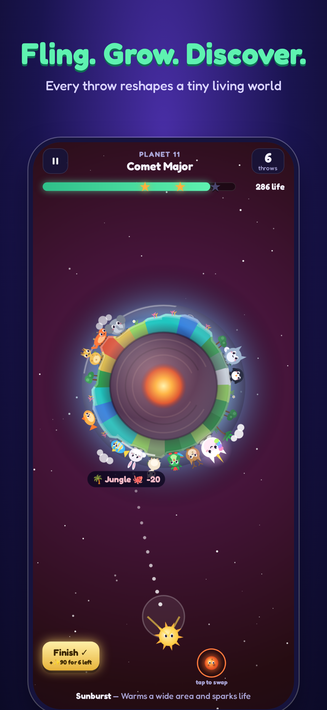
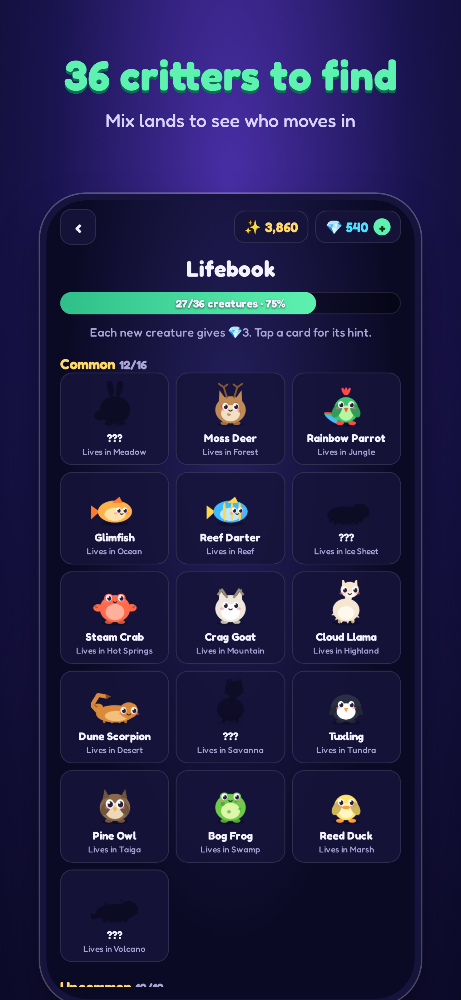
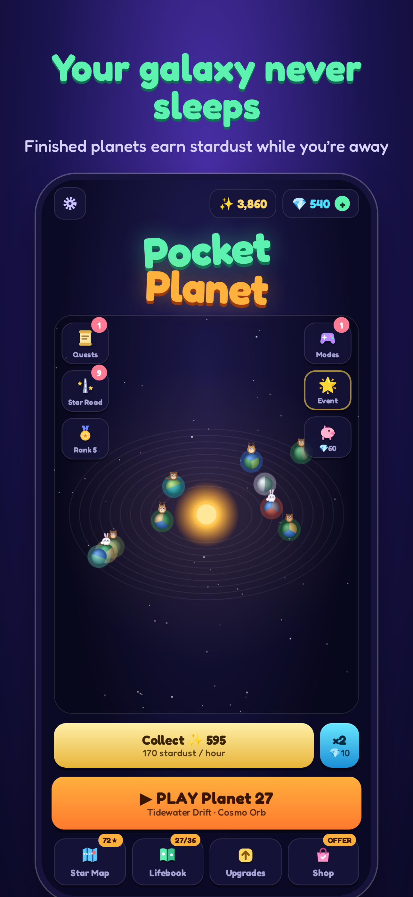
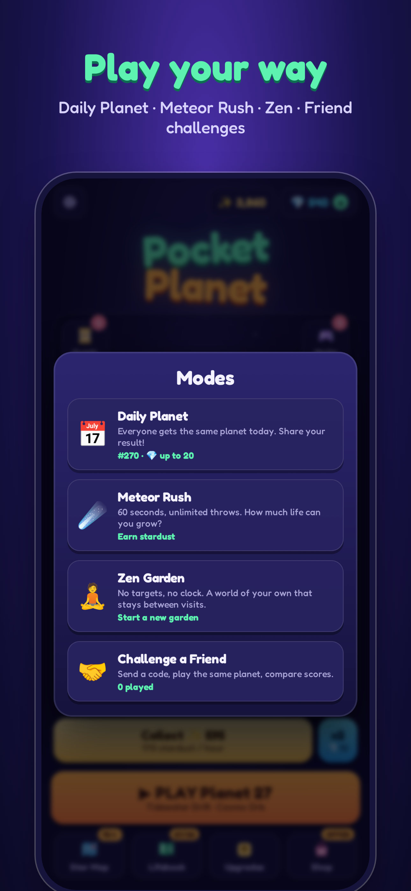

# 🪐 Pocket Planet

Fling rocks, ice comets, magma and seeds at a tiny spinning planet. Gravity bends every shot, so aiming is part of the fun. Each hit changes the land: rock raises mountains, ice fills oceans, magma builds volcanoes and seeds grow forests. When the right lands sit next to each other, critters move in. A forest beside an ocean brings otters, and a volcano beside the sea brings obsidian turtles.

<p align="center"></p>

<p align="center">   </p>

See [ROADMAP.md](ROADMAP.md) for the production roadmap and the research behind it.

## What's in the game

| Area                 | Features                                                                                                                                                                                                                                                              |
| -------------------- | --------------------------------------------------------------------------------------------------------------------------------------------------------------------------------------------------------------------------------------------------------------------- |
| **Core play**        | One-minute levels, slingshot aiming with gravity, a landing-spot preview ("⛰️ Mountain 🐐 +13"), tiered callouts and a chain counter, shockwaves, confetti, and a score that heats up. The **Meteor finale** turns unused throws into stardust.                       |
| **Art**              | 36 vector critters in one house style, a procedural planet renderer (terrain, shallows, soil, clouds, lighting), biome props and six projectile characters. No emoji in the game world.                                                                               |
| **Progression**      | Star Map chapters of 10 planets with chests. The **Star Road** reward track has a free lane and a **Cosmic Pass** lane. Also: daily quests, **Explorer Rank** (3 standing goals), Lifebook habitat sets, **Momentum** win streaks, and **Hard / Super Hard** planets. |
| **Modes**            | **Daily Planet** (seeded, with Wordle-style emoji share), **Meteor Rush** (60 s), **Zen Garden** (a persistent sandbox) and **Challenge a Friend** (share codes with a check letter). None of these need a server.                                                    |
| **Idle & retention** | Your galaxy earns stardust while you're away. **Visitors** leave gifts and mementos. There is a daily gift streak, a welcome-back gift, opt-in reminders (daytime only), and a rating prompt after a 3★ clear.                                                        |
| **Onboarding**       | Coach tips on the first planets, intro cards for new objects, and the Starter Pack offered once after the first chapter chest.                                                                                                                                        |
| **Audio**            | Synthesized sound effects plus generative music themes for home, each chapter and each mode. Respects the silent switch.                                                                                                                                              |
| **Accessibility**    | Reduce-motion setting and separate toggles for sound, music and haptics.                                                                                                                                                                                              |

## How it makes money (StoreKit 2, no server)

| Product ID                         | Type           | Price  | What you get                                                                                                       |
| ---------------------------------- | -------------- | ------ | ------------------------------------------------------------------------------------------------------------------ |
| `com.pocketplanet.game.gems80`     | Consumable     | $0.99  | 80 💎                                                                                                              |
| `com.pocketplanet.game.gems500`    | Consumable     | $4.99  | 500 💎                                                                                                             |
| `com.pocketplanet.game.gems1200`   | Consumable     | $9.99  | 1,200 💎                                                                                                           |
| `com.pocketplanet.game.gems2800`   | Consumable     | $19.99 | 2,800 💎                                                                                                           |
| `com.pocketplanet.game.piggy`      | Consumable     | $1.99  | Breaks the piggy bank. Each planet you finish adds 💎4, up to 250. It appears from chapter 2.                      |
| `com.pocketplanet.game.starter`    | Non-consumable | $2.99  | 300 💎, 5 of every booster, and the Aurora atmosphere                                                              |
| `com.pocketplanet.game.cosmicpass` | Non-consumable | $4.99  | Premium Star Road lane (880 💎 in total, the Cosmic atmosphere, stardust and boosters). It pays out retroactively. |

Gem sinks: +5 throws (40 / 70 / 110 💎), boosters, atmospheres, and doubling offline stardust (💎10).

The game has no ads, no lives or energy timers, no loot boxes and no tracking. Every purchase shows exactly what you get.

## Tech

TypeScript + Vite + Canvas 2D, wrapped as a native iOS app with **Capacitor 8** (Swift Package Manager, no CocoaPods). Plugins: native-purchases (StoreKit 2), haptics, preferences, local notifications, in-app review, share, filesystem, splash screen, status bar, plus a small built-in Game Center plugin (`ios/App/App/GameCenterPlugin.swift`).

```
src/core/        simulation (world.ts) and seeded level generator + solver (levels.ts)
src/meta/        pure game logic: profile/saves, economy, progression, momentum,
                 visitors, rank, habitats, modes, config (all prices & tuning)
src/ui/app.ts    app shell: screens, level flow, purchases
src/ui/screens/  home, galaxy, star map, star road, lifebook, upgrades, shop
src/ui/flows/    modals: pre-level, results, daily gift, quests, rank, visitors,
                 modes, offers, settings
src/ui/art/      procedural planet, critters, props, projectiles
src/ui/game.ts   the level scene: physics, aiming, effects, HUD, modes
tests/           world, recipes, economy, progression, features, level balance
store/           App Store listing copy and framed screenshots
docs/            privacy policy (host with GitHub Pages)
resources/       icon/splash renderer (uses the game's own art code)
ios/             Xcode project
```

```bash
npm install
npm run dev          # play in a browser; purchases are simulated in dev
npm test             # includes "every level in the first six chapters is beatable"
npm run typecheck && npm run format:check
npm run icon         # re-render icon + splash (needs `npm run dev` running)
npm run ios:sync     # build + copy into Xcode project
npm run ios:open
```

CI runs formatting, the typecheck, the tests and the build on every push.

## Play it in the iOS Simulator (no build needed)

Every CI run on `main` compiles a Simulator build. On a Mac with Xcode installed:

1. Open the repo's **Actions** tab, pick the latest **CI** run on `main` (or press _Run workflow_), and download **PocketPlanet-Simulator** from _Artifacts_.
2. Unzip it, then run:

```bash
open -a Simulator                         # boots the default iPhone
xcrun simctl install booted App.app       # from the unzipped folder
xcrun simctl launch booted com.pocketplanet.game
```

Purchases need a StoreKit configuration, which only applies when you run from Xcode (step 4 below). To build it yourself instead: `npm install && npm run ios:sync && npx cap run ios`.

## Shipping to the App Store

Use the [iOS release checklist](docs/qa/release.md) for the candidate, native QA, TestFlight soak, and App Store submission. The bundle ID is `com.pocketplanet.game`, the app is iPhone-only, and the minimum iOS version is 15.4.

1. The owner enrols in the Apple Developer Program, selects the signing Team in Xcode, registers the bundle ID with Game Center, and completes the Paid Applications Agreement, tax, banking, and App Store Connect app record. Create IAPs from the frozen product sheet; their identifiers and Family Sharing settings are permanent.
2. From a clean working tree, run `npm run ios:release`. It installs from the lockfile, builds the web app, syncs Capacitor, checks the native web bundle for tester and development hooks, bumps the iOS build number, and prints the Release archive command. Review and commit that build-number change.
3. The shared Xcode `App` scheme uses `ios/App/PocketPlanet.storekit` for Simulator purchase tests. Use sandbox accounts for TestFlight. Check Game Center sign-in, the six native localizations, Photos Save Image, and the StoreKit matrix in the release checklist.
4. Archive with the signing Team, inspect Xcode Organizer's Privacy Report, upload IAP screenshots and current localized store assets, then distribute through TestFlight. After the 48-hour adult-tester soak, submit with manual release and phased release enabled.
