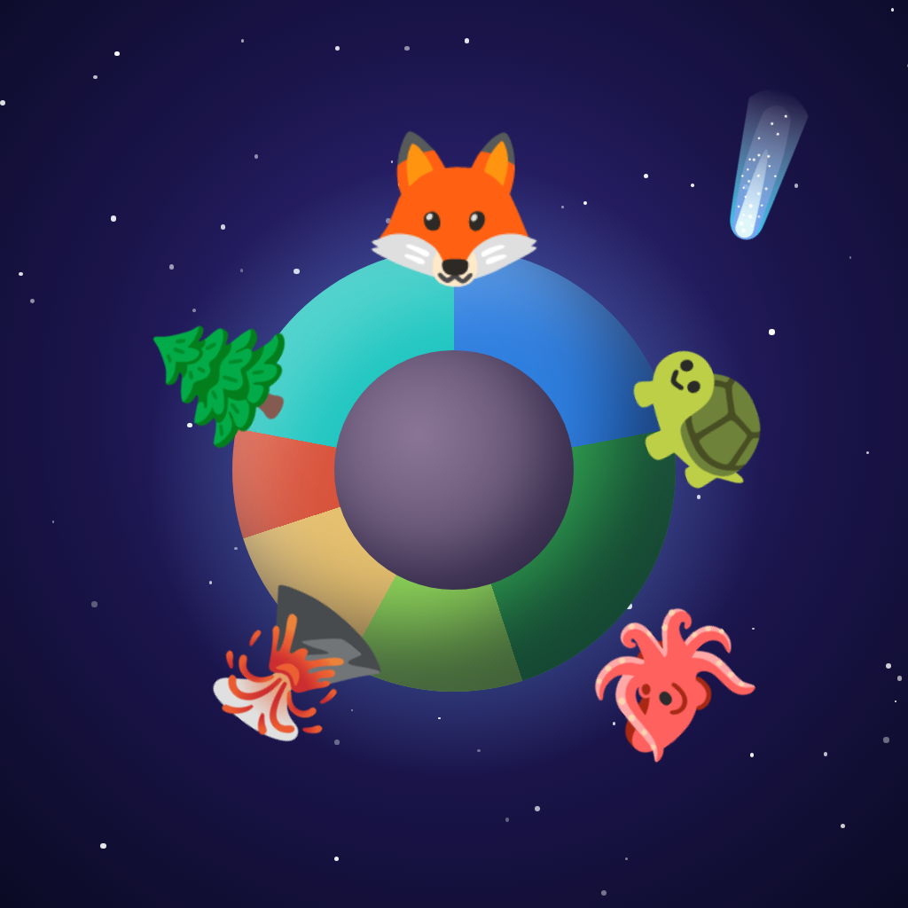

# 🪐 Pocket Planet

Fling rocks, ice comets, magma and seeds at a tiny spinning planet. Gravity bends every shot, so aiming is part of the fun. Each place you hit changes the land: rock raises mountains, ice fills oceans, magma builds volcanoes and seeds grow forests. When the right lands sit next to each other, creatures move in. A forest beside an ocean brings otters, and a volcano beside the sea brings obsidian turtles.

<p align="center"></p>

## Why people keep playing

| Hook                    | How it works                                                                                                                                                    |
| ----------------------- | --------------------------------------------------------------------------------------------------------------------------------------------------------------- |
| **One-minute levels**   | Each planet is a level with a limited number of throws and a 1–3★ life target. It fits in a waiting room.                                                       |
| **Satisfying to touch** | Slingshot aiming with a dotted trajectory, haptics, particles, screen shake and synthesized sound that rises in pitch.                                          |
| **Discovery**           | 37 creatures in the Lifebook, from common to legendary (Leviathan, World Tree Spirit). Every new one is a "NEW!" moment and pays gems.                          |
| **Your galaxy grows**   | Finished planets orbit your sun and earn stardust **while you're away**, up to a vault limit. Coming back to collect is the daily habit.                        |
| **Upgrades**            | Stardust buys a longer aim guide, extra throws, wider impacts and a bigger vault.                                                                               |
| **Variety**             | Levels are generated from a seed with twists (Fast Spin, Tiny World, Moon Guard, Scorched, Snowball, Water World). New objects unlock at levels 2, 4, 7 and 11. |
| **Daily gift**          | A 7-day gem streak.                                                                                                                                             |

Levels are **auto-balanced**. Each level's star targets are set from a solver that plays the level's own throw sequence, so every level is provably beatable and gets harder at a steady rate.

## How it makes money (Apple in-app purchases, StoreKit 2)

| Product ID                       | Type           | Price  | What you get                                                                                            |
| -------------------------------- | -------------- | ------ | ------------------------------------------------------------------------------------------------------- |
| `com.pocketplanet.game.gems80`   | Consumable     | $0.99  | 80 💎                                                                                                   |
| `com.pocketplanet.game.gems500`  | Consumable     | $4.99  | 500 💎                                                                                                  |
| `com.pocketplanet.game.gems1200` | Consumable     | $9.99  | 1,200 💎                                                                                                |
| `com.pocketplanet.game.gems2800` | Consumable     | $19.99 | 2,800 💎                                                                                                |
| `com.pocketplanet.game.piggy`    | Consumable     | $1.99  | Breaks your **piggy bank**. Every level you finish drops 💎4 in it (max 250), and you buy to keep them. |
| `com.pocketplanet.game.starter`  | Non-consumable | $2.99  | 300 💎, 5 of every booster, and the Aurora atmosphere                                                   |

Where players spend gems:

- **+5 throws** when a level ends: 40 / 70 / 110 💎. It's shown at the moment you're "only 7 life from the next star."
- **Boosters** before a level: Comet Shower (+3 throws), Life Spark (start with meadows), Star Scope (full aim guide). These can also be bought with stardust.
- **Atmosphere skins.**

Players earn gems for free from new creatures (💎3 each), 3-star clears, and the daily streak. There are no ads, no tracking and no loot boxes.

## Tech

TypeScript + Vite + Canvas 2D, wrapped as a native iOS app with **Capacitor 8** (Swift Package Manager, no CocoaPods). In-app purchases use `@capgo/native-purchases` (StoreKit 2, no server needed). All sound is synthesized with WebAudio, and it respects the silent switch.

```
src/core/world.ts    planet simulation: biomes, creatures, impacts, life score
src/core/levels.ts   seeded level generator + auto-balancing solver
src/meta/            profile/saves, product & balance config, purchases
src/ui/game.ts       the level: gravity physics, aiming, rendering, effects
src/ui/app.ts        galaxy home, level flow, Lifebook, upgrades, shop
ios/                 Xcode project
resources/           app icon (HTML source + PNG)
```

```bash
npm install
npm run dev        # play in a browser; purchases are simulated in dev
npm test           # simulation tests (including "every Lifebook recipe is true")
npm run build
npm run ios:sync   # build + copy into Xcode project
npm run ios:open
```

All tuning (prices, rewards, boosters, upgrades) lives in `src/meta/config.ts`. Creatures and biomes are in `src/core/world.ts`, and level difficulty is in `src/core/levels.ts`.

## Shipping to the App Store

1. **You need** a Mac with Xcode 16+ and an [Apple Developer Program](https://developer.apple.com/programs/) membership ($99/year).
2. **Make it yours:** change `appId` in `capacitor.config.ts` and the bundle ID in Xcode to one you own. If you change the product IDs, update them in `src/meta/config.ts`.
3. **Build:** run `npm install`, `npm run ios:sync` and `npm run ios:open`. In Xcode, pick your Team under _Signing & Capabilities_ and add the **In-App Purchase** capability.
4. **Test purchases in the Simulator:** go to _Product → Scheme → Edit Scheme → Run → Options → StoreKit Configuration_ and choose `PocketPlanet.storekit`.
5. **App Store Connect:**
   - Sign the **Paid Apps** agreement and add banking and tax details.
   - Create the app.
   - Create the 6 in-app purchases with the exact IDs above: 5 consumables and 1 non-consumable. Each needs a price, a description and a review screenshot.
6. **App Privacy:** answer "Data Not Collected". `ios/App/App/PrivacyInfo.xcprivacy` is included, and export compliance is already set in Info.plist. You also need a privacy policy URL; a one-line "we collect nothing" page is enough.
7. **Upload:** _Product → Archive → Distribute → App Store Connect_, test through TestFlight with a Sandbox account, then submit with the in-app purchases attached.

The app is iPhone-only and portrait-only, so you only need iPhone screenshots.
